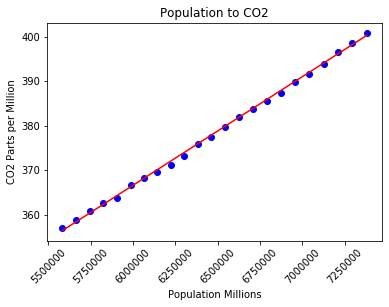
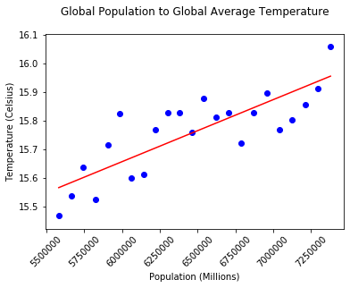
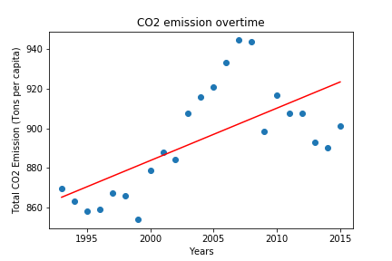
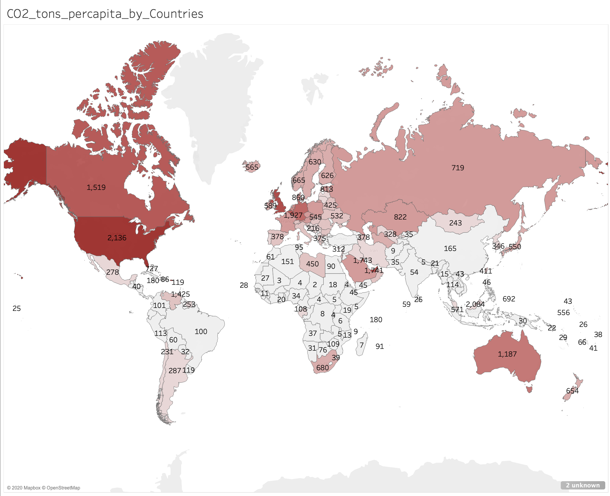
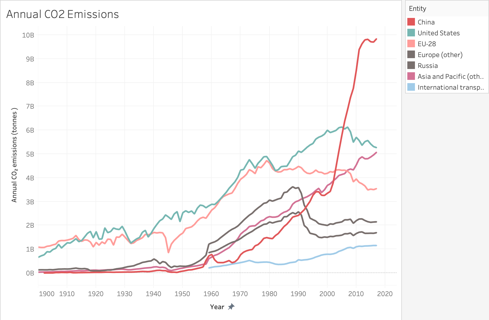
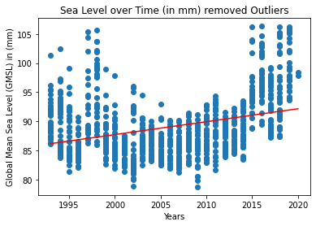
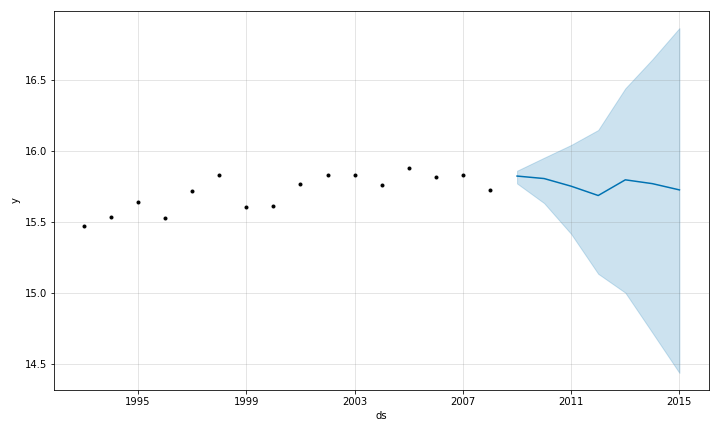

# Final_project

## By John Byun, Kat Anggasastra, Melissa Wright and Molly Cox
### [With additional technical support from tutors Mark Steadman and Alexis McKenzie]
## The Task
1. Find a problem worth solving, analyzing, or visualizing: Problem: Climate Change
2. Use ML in the context of technologies learned.
3. Use: Scikit-Learn and/or another machine learning library. We used: SkLearn AND Prophet  https://facebook.github.io/prophet/
4. Use at least two of: We Use:  Python Pandas , Python Matplotlib , Plotly, and Tableau
5. 15-minute data deep-dive or infrastructure walkthrough that shows machine learning in the context of what we’ve already learned.
6. Examples: Create an analysis of existing data to make a prediction, classification, or regression. We use: Prediction and Regression

## Story/Presentation
Link to our presentation: https://docs.google.com/presentation/d/1W4qb2kSybrv-npmgUroosTjibiVxcqSSfeEkr-MFHPc/edit?usp=sharing

 ## Climate Analysis and Forecasting with Machine Learning (1993-2015)

#### Motivation:  
* Inspired by Earth Day, and our previous research on contributing factors to CO2 emissions from our first bootcamp project (Commute Chaos), we decided to research historical datasets to make climate predictions with machine learning. We also wondered what impacts the global shelter-in place might have on the climate. We looked at population, emissions and what relationship they have on temperature, the melting of glaciers and rise in sea level. Climate Scientists tell us that the Earth is warming, which will have catastrophic global effects, so our team used machine learning to study just how soon we will reach the dangerous temperatures climate scientists may be referring to. 

####  Background: 
* According to the Paris Climate Agreement of 2015,  the global goal is to limit the overall increase in global temperature by 1.5℃ or less from the average prior to pre-industrial times. Determining how to calculate the starting temperature is controversial, but for the sake of argument, we took the average temperature in our dataset for 1850, which was around 14.87℃ or 58.76℉. An increase of 1.5℃ would be 16.37℃, or 61.47℉.  

#### Summary:
* We compared data of temperature, sea level, CO2 emissions and population from 1993-2015. We levered our machine learning forecast to  answer at When will the temperature rise to a dangerous level of 16.37 𝇈C /61.47𝇈F? Our research and analysis showed that there is a positive trend in the rise of population, CO2 emissions, temperature and global mean sea level. We leveraged machine learning to create a forecast for the next 10 years. Our model showed as a good model from the testing and training data. The forecast showed a positive trend that we saw that we will reach the concerning temperature between 2028-2038 . We used sklearn and prophet along with visualizations in Tableau to examine our datasets. Our sources of data are all listed below at the bottom of this paper. 

#### Our question : "When will we reach the concerning temperature?" 

* CO2 emissions from burning fossil fuels. CO2 emissions are also produced by natural processes, but up to 1880, the earth could absorb those and keep temperatures stable. Man-made emissions are pushing the Earth out of balance,  causing more CO2 to stay in the atmosphere and create a “greenhouse gas” effect to warm the planet. 

* Population -  increased population results in increased energy consumption and fossil fuel burning, which would lead to higher CO2 levels.

Effects of Climate Change:
* Temperatures - increasing - leads to more extreme weather events and melting of sea ice, which leads to:
* Sea Level - Sea Level is constantly ranging as it is affected by tidal changes. Satellite sensors are used to measure the global mean sea level. Overall sea level rising causes coastal flooding resulting in islands to be submerged, consequently causing displacements of population therefore it is an important dataset to monitor. 

### Analysis:

* Population Increase: 
During the period from 1900-2020, the human population grew from 2.5 billion to 7.7 billion people, a greater than 3 fold increase in a matter of just 70 years with an increase of 2.2 billion from 1993 to 2020, the chosen time period for our study. 

* Increase in CO2 Emissions based on population: 
A greatly increased human reliance on mechanized transportation over the past 1.5 centuries has led to greatly increased consumption of fossil fuels and CO2 emissions into the atmosphere.   The linear regression model pointed to a strong relationship between the increasing population and an increase in CO2 concentration in the atmosphere as measured in parts per million, with an R2 value of 0.99 and MSE of 0.32. 

* Temperature rise by Year:
We took the temperature dataset from Berkeley Earth, which had temperature data going back to 1850.  We used the average combined land and sea temperature for that year.  Our regression produced the following plot:

* The chart shows a slow increase in temperature from 1850 to roughly 1980, and then a sharper rise noted by the regression line. <strong> Contributing factors to the rise from the 1980's could be interpreted as a loss in balance for the earth to naturally handle the levels of CO2. </strong>   Plugging in the temperature 16.37 into the linear equation, the Year this temperature is reached would be 2038.

* Temperature rise based on population:
Using the same temperature dataset for the years 1993 to 2015, we looked at the relationship between population data and temperature. Our regression produced this plot:

This chart shows that temperature rises with population.  According to this regression line, a temperature of 16.37 would be reached when the population reaches approximately 9.29 Billion, which is in the ballpark for projected population size for that year.

* CO2 Emissions as related to Population growth
According to this regression line, the population has a direct correlation to CO2 Emissions. 

* CO2 Emissions over time. 

 
 linear regression model based on year and total CO2 emission tons per capita. 
The peak you see prior to 2006 is the rapid growth of carbon emissions with no sign of slowing down! 
However, it quickly declining by 14% from the peak in 2005 and end in 2016; 
The drop you see results from our new alternative technologies. Main 3 technologies are:  
The power sector are switching gear from coal to gas 
3% use of Solar technology   
17% use of Wind technology   

* CO2 Emissions per capita by country. 

According to this Tableau visualization, The map shows the top 10 culprits with the highest CO2 emission per capita
* But hey look! US is number one on the list since 1945! 
* However, the one unexpected one is Trinidad and Tobago - a tiny little country off the coast northeastern Venezuela is #8 on the list! 

* The map shows the total sum of co2 tons per capita breakdown by each country from 1949 - 2017. Top 4 CO2 emission countries are: United States(2,136), England(1,927), Australia(1,187), and Canada(1,519)   According to our other data on co2 based on yearly average ppm(parts per millions); the report mentions that the ppm had rapidly grown since 1910 where the ppm is around 300 and now in 2018, are at 408.52. In the past 108 years, our co2 ppm had grown 108.52 around 1% per each year. 
* China’s ppm is rather low because they only began ramping up their industrialization since 1947, however, we see that China is the highest emitter in total CO2 emissions by country on an annual basis. 

##### Update 30 April 2020: The International Energy Agency has forecast the CO2 impact of the crisis, suggesting emissions could fall by 8% this year, some 2,600MtCO2. It draws on more recent data and covers 100% of global emissions, whereas Carbon Brief’s estimate was based on information covering only around 75% of the total. Global emissions would need to fall by some 7.6% every year this decade  – in order to limit warming to less than 1.5C above pre-industrial temperatures.

* Sea Level rise over time. Data used from 1993-2015 was the global mean sea level and that number averaged by year shows a linear and downward trend because it is incomplete.  Data from 1993-2020 was also looked at further and that showed an upward trend.  

* A linear regression model based on year and global mean sea level. 
* The outliers appear to be a result in the changes of sattelites used. 

* Now let's look at the full picture

* linear regression model based on year and global mean sea level but now looking at the fuller range time period. 
* The outliers remain and appear to be a result in the changes of sattelites used but we now see an upward trend. 

* Now let's look at every data point without outliers 

* A linear regression model based on year and global mean sea level but now looking at the fuller range time period with the data from the measures of sea level taken every 10 days by the sattelite. 
*This helps us form a better picture and see a rise in sea level over time. 

#### General Visualization

=======

##### Machine Learning Trend

#####  Machine Learning Prediction

##### Machine Learning Testing/Training

# Conclusion: 

Our research showed a positive trend and forecasted 18 years until the dangerous level is reached.  We used sklearn and visualizations in Tableau and the sources of data included: NASA, Berkeley Earth, United Nations.__Findings__: The multivariate prediction models indicate that we will reach the concerning temperatures by 2038.

## Datasets & Data Scrubbing Process

#### Temperature Data
Data Source:  https://www.kaggle.com/berkeleyearth/climate-change-earth-surface-temperature-data#GlobalTemperatures.csv
Original Source is Berkeley Earth Surface Temperature Study, a group affiliated with Lawrence Berkeley National Laboratory
We are interested in Average Yearly Land and Ocean Data from 1990 on.
* __Source File__:        GlobalTemperatures.csv
* __Jupyter Notebooks__:   
__Scrubbing Files__:  Temp_Scrub,  Temp_Scrub-AllYears,   Temp_Scrub-AllYears-Min-Max  
__Analysis Files__:  x_CO2_y_Temperature_correlation, x_MinTemp_y_MaxTemp_correlation,   x_Population_y_Temperature_correlation,   x_Year_y_Temperature_correlation  
* __Scrubbed Data Files__:      temp_data.csv, temp_data-AllYears.csv, temp_data-Min-Max.csv
* __Visualization Images (.png)__:  
population_to_co2, co2_to_temp, pop_to_temp, Min_vs_Max_Temp, Year_to_Temp_correlation

#### Sea Level Data 
Data Source: https://sealevel.nasa.gov/understanding-sea-level/key-indicators/global-mean-sea-level/
This dataset contains the Global Mean Sea Level (GMSL) generated from the Integrated Multi-Mission Ocean Altimeter Data for Climate Research (GMSL dataset) available for download. 
* __Source File__: GMSL_merged_nasa_1993_2020
* __Jupyter Notebooks__:  sealevel_scrub.ipynb, sealevel_scrub_2_for_visuals_by_day.ipynb, Sealevel_visualizations.ipynb
* __Analysis Files__:  sealevel_data.csv, sealevel_data__all_1993-2020.csv, rm_outliers_grouped_sealevel_data.csv, data/sealevel_data__all_1993-2020.csv,   rm_outliers_sealevel_1993-2020.csv
* __Visualization Images (.png)__: sealevel_scrub_fig1, sealevel_scrub_fig2, sealevel_overtime_1993-2015, sealevelovertime1993-2020, sealevel__removed_outliers-1993-2020, sealevel_removed_outliers-1993-2015

#### Population Data found :
Data Source: https://population.un.org/wpp/Download/Files/1_Indicators%20(Standard)/EXCEL_FILES/1_Population/WPP2019_POP_F01_1_TOTAL_POPULATION_BOTH_SEXES.xlsx
This source contains an Excel files with historical population by country and region as well as population growth predictions based on various birth fertility scenarios. 
* __Source File__:        WORLD_POP.csv 
* __Jupyter Notebooks__:  population_scrub.ipynb, population_to_co2_ml.ipynb
* __Scrubbed Data Files__: population_data.csv, co2_ppm.csv
* __Visualization Images (.png)__: 

#### Emissions Data found :
Data Source: https://ourworldindata.org/grapher/co-emissions-per-capita?tab=chart&country=AUS+CAN+USA+OWID_WRL - This dataset    contains Global CO2 emission per capita from 1800 to 2017 to measure our total CO2 from the past to current. 
             https://ourworldindata.org/co2-and-other-greenhouse-gas-emissions - Needed 2nd dataset for our machine learning prediction as it has more accuracy based on the CO2 ppm.  
* __Source File__:        co2-concentration-long-term.csv, co-emissions-per-capita.csv
* __Jupyter Notebooks__:  emissions_scrub.ipynb
* __Scrubbed Data Files__:      co2_ppm.csv and co-emissions-per-capita.csv
* __Visualization Images (.png)__: population_growth.png, population_to_c02.png
CO2_emission_overtime.png, CO2_ppm.png, CO2_emission_tons_per_capita.png

### For Correlation and Analysis 
* __Source File__: temp_data.csv + sealevel_data.csv + population_data.csv + co2_ppm.csv
* __Jupyter Notebooks__:  climate_combined.ipynb
* __Scrubbed Data Files__: combinedclimatedata.csv 

### For Machine Learning 2 steps (Step 1. Adding datestamp for Step 2. Analysis Forecasting)
* __Source File__: combinedclimatedata.csv + datestamp.csv
* __Jupyter Notebooks__:  Step 1:climate_combined_forprophet.ipynb
* __Jupyter Notebooks__: Step 2:prophet_timeseries_prediction_final.ipynb
*__Visualization Images (.png)__: __basic prediction__: ML_basic_fig1.png, __trend of prediction__ :ML_trend_fig2.png. Machine Learning : __change points__: ML_change_temp_fig4.png, __forecasting images__: ML_forecast_temp_fig6.png and ML_forecast_yearly_fig8.png. Testing/Training images: ML_train_model_fig9.png 

#### Challenges
* Access to more correlative datasets like cars/planes/solar panels    
* Access to historical data for all climate change datasets
* Access to granular level or wetland data, ice melting data etc. 

#### What would you research next, if you had two more weeks
* Add More historical data for all climate change datasets
* Add Ice melting data as it relates to climate change.
* Added more emissions into our forecasting models 

